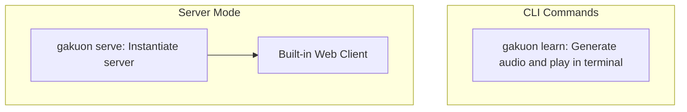

# gakuon (学音)

[](https://www.npmjs.com/package/gakuon)

[Project board →](https://github.com/users/Yukaii/projects/10/views/1)

[Good First Issues →](https://github.com/users/Yukaii/projects/10/views/8)

学音 (Gakuon) is an AI-powered audio learning system for Anki that transforms your flashcard reviews into an immersive audio experience. It automatically generates contextual sentences, explanations, and natural speech for your cards, allowing you to maintain your Anki reviews through passive listening.

## Features

- AI-powered generation of natural example sentences and multilingual explanations with high-quality TTS conversion.
- Efficient content management with cached results, configurable card ordering, and keyboard-driven reviews.
- Ideal for language learners, multitaskers, and anyone looking to enhance their Anki cards with engaging audio.

### How is gakuon different?

- A standalone CLI to generate audio (TTS) out of your anki cards
- Accompanied with standalone server mode and a built-in web client to play audio.
- Stores additional metadata in an extra meta field without breaking your existing anki cards

## Architecture



> [!WARNING]
> This program would add extra fields to your card type! Understand what you're doing

## Prerequisite

* Setup Anki with AnkiConnect locally
* ffplayer (installed along with ffmpeg)

## Installation

```bash
npm install -g gakuon
```

## Usage

```bash
gakuon learn
```

## Commands

Gakuon provides several commands to help you manage and use your audio learning system:

### `learn`

Start an audio-based learning session:

```bash
gakuon learn              # Use default or select deck interactively
gakuon learn --deck NAME  # Use specific deck
gakuon learn --debug     # Enable debug logging
```

### `init`

Initialize deck configuration interactively:

```bash
gakuon init              # Generate config interactively
gakuon init --write      # Save generated config to file
gakuon init --debug      # Enable debug logging
```

### `serve`

Start the Gakuon HTTP server:

```bash
gakuon serve                # Start server on default port 4989
gakuon serve -p 3000        # Use custom port
gakuon serve --debug        # Enable debug logging
gakuon serve --serve-client # Also serve builtint PWA client app
```

### `test`

Test deck configuration with sample cards:

```bash
gakuon test              # Test default or selected deck
gakuon test --deck NAME  # Test specific deck
gakuon test -n 5         # Test with 5 sample cards (default: 3)
gakuon test --debug      # Enable debug logging
```

## Deployment

For production deployment using Docker Compose, see the [Docker Setup Guide](deployment/compose/README.md).

## Development

To set up the development environment for both server and client:

1. Install dependencies:

```bash
bun install
```

2. Start the backend server in development mode:

```bash
bun run start
# Alternatively, start the server in debug mode:
bun run start serve -d
```

3. For full-stack development, the server will be available along with the built-in PWA client.

4. Frontend Development:
   Frontend engineers can work on the client without spinning up the entire backend stack. Instead, start the headless Anki service using the simplified Docker Compose file. This exposes the AnkiConnect API on port 8765, allowing you to run the PWA client in isolation.

   To start the headless Anki service, run:

```bash
docker compose -f deployment/compose/docker-compose.simple.yml up -d
```

   Then, start the PWA client development server:

```bash
bun run dev:client
```

## Configuration

Gakuon can be configured using either environment variables (for global settings) or a TOML configuration file (for both global and deck-specific settings).

### Environment Variables

Global settings can be configured using these environment variables:

```bash
# Global Settings
GAKUON_ANKI_HOST="http://localhost:8765"  # Anki-Connect host
OPENAI_API_KEY="sk-..."                    # OpenAI API key
GAKUON_TTS_VOICE="alloy"                   # TTS voice to use
GAKUON_DEFAULT_DECK="MyDeck"               # Default deck name

GAKUON_OPENAI_CHAT_MODEL="gpt-4o" # Model for chat completions
GAKUON_OPENAI_INIT_MODEL="gpt-4o" # Model for initialization

# Card Order Settings
GAKUON_QUEUE_ORDER="learning_review_new"   # Options: learning_review_new, review_learning_new, new_learning_review, mixed
GAKUON_REVIEW_ORDER="due_date_random"      # Options: due_date_random, due_date_deck, deck_due_date, ascending_intervals, descending_intervals, ascending_ease, descending_ease, relative_overdueness
GAKUON_NEW_CARD_ORDER="deck"               # Options: deck, deck_random_notes, ascending_position, descending_position, random_notes, random_cards

# Base64 encoded full config (optional)
BASE64_GAKUON_CONFIG="..."                 # Base64 encoded TOML config
```

### TOML Configuration File

For more detailed configuration including deck-specific settings, use `~/.gakuon/config.toml`:

```toml
[global]
ankiHost = "http://localhost:8765"
openaiApiKey = "${OPENAI_API_KEY}"  # Will use OPENAI_API_KEY environment variable
ttsVoice = "alloy"
# Optional field. Used with CLI learn command
defaultDeck = "Core 2k/6k Optimized Japanese Vocabulary with Sound Part 01"

[global.openai]
baseUrl = "https://api.openai.com/v1"
chatModel = "gpt-4o"
initModel = "gpt-4o"
ttsModel = "tts-1"

[global.cardOrder]
queueOrder = "learning_review_new"
reviewOrder = "due_date_random"
newCardOrder = "deck"

[[decks]]
name = "Core 2k/6k Japanese"
pattern = "Core 2k/6k.*Japanese"
fields.word = "Vocabulary-Kanji"
fields.meaning = "Vocabulary-English"
fields.context = "Expression"

prompt = """
Given a Japanese vocabulary card:
- Word: ${word}
- Meaning: ${meaning}
- Context: ${context}

Generate helpful learning content.
"""
[decks.responseFields]
example.description = "A natural example sentence using the word"
example.required = true
example.audio = true

explanation_jp.description = "Simple explanation in Japanese"
explanation_jp.required = true
explanation_jp.audio = true

explanation_en.description = "Detailed explanation in English"
explanation_en.required = true
explanation_en.audio = true

usage_notes.description = "Additional usage notes"
usage_notes.required = false
usage_notes.audio = false
```

## References

- Thanks to [ThisIsntTheWay/headless-anki](https://github.com/ThisIsntTheWay/headless-anki) for providing the Dockerized Anki implementation that powers our headless Anki server setup
