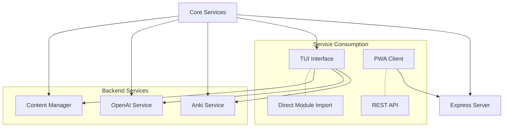
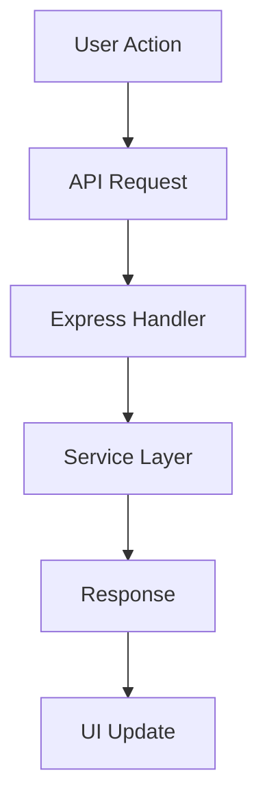
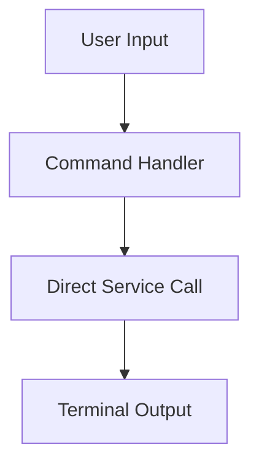

# App Flow Documentation

## 1. Core Architecture Overview

Gakuon is a learning system with dual interfaces: a web interface (PWA) and a terminal interface (TUI). Both interfaces share the same core services but differ in how they consume them.



File Structure:
```
src/
├── client/           # React PWA client
│   ├── components/   # UI components
│   ├── api/         # API client
│   └── views/       # Page components
├── commands/         # CLI commands
│   ├── learn.ts     # TUI interface
│   └── serve.ts     # Web server
├── services/        # Shared services
│   ├── anki.ts     # Anki integration
│   ├── openai.ts   # AI services
│   └── audio.ts    # Audio handling
└── utils/          # Shared utilities
```

## 2. Service Architecture

### Core Services
1. **Service Layer**: Shared business logic
   ```typescript
   // src/services/content-manager.ts
   export class ContentManager {
     constructor(
       private ankiService: AnkiService,
       private openaiService: OpenAIService,
       private ttsVoice: string,
     ) {}

     async getOrGenerateContent(card: Card, config: DeckConfig) {
       // Shared content generation logic
     }
   }
   ```

### Service Consumption Methods

1. **TUI Interface**: Direct module imports
   ```typescript
   // src/commands/learn.ts
   const contentManager = new ContentManager(
     ankiService,
     openaiService,
     config.global.ttsVoice,
   );
   ```

2. **Web Interface**: REST API abstraction
   ```typescript
   // src/client/api/index.ts
   export async function fetchCard(cardId: number) {
     const response = await fetch(`/api/cards/${cardId}`);
     return response.json();
   }
   ```

## 3. Interface Implementations

### Web Interface (Primary)
1. **Express Server**:
   ```typescript
   app.get("/api/cards/:id", async (req, res) => {
     const cardId = Number(req.params.id);
     const card = await ankiService.getCardsInfo([cardId]);
     const content = await contentManager.getExistingContent(card);
     res.json(content);
   });
   ```

2. **PWA Client**:
   ```typescript
   // src/client/views/DeckView.tsx
   export function DeckView() {
     const { data: cardInfo } = useSWR(
       `/api/cards/${cardId}`,
       fetchCard
     );

     return (
       <div>
         <AudioPlayer urls={cardInfo.audioUrls} />
         <CardControls />
       </div>
     );
   }
   ```

### Terminal Interface (Secondary)
```typescript
// src/commands/learn.ts
export async function learn() {
  const contentManager = new ContentManager(/* ... */);

  // Direct service usage
  const cards = await ankiService.getDueCardsInfo(deckName);
  const content = await contentManager.getOrGenerateContent(card);

  // Terminal-specific UI
  keyboard.on(KeyAction.PLAY_ALL, async () => {
    await audioPlayer.play(content.audioFiles);
  });
}
```

## 4. Data Flow

### Web Interface Flow


### TUI Flow


## 5. API Integration

1. **REST Endpoints**:
   ```typescript
   GET    /api/decks
   GET    /api/decks/:name/cards
   GET    /api/cards/:id
   POST   /api/cards/:id/answer
   GET    /api/audio/:filename
   ```

2. **Direct Service Methods**:
   ```typescript
   ankiService.getDueCardsInfo()
   contentManager.getOrGenerateContent()
   audioPlayer.play()
   ```

## 6. Operational Flow

### Web Operations
1. **Card Management**:
   - Fetch through REST API
   - Stream audio via HTTP
   - Update through POST requests

2. **State Management**:
   - Client-side SWR
   - Server-side caching
   - Audio streaming

### TUI Operations
1. **Card Processing**:
   - Direct service calls
   - In-memory audio handling
   - Keyboard event handling

The architecture leverages the same core services while providing appropriate interfaces for different use cases. The web interface offers a modern, accessible experience through REST APIs, while the TUI provides a lightweight, direct interaction through module imports.
